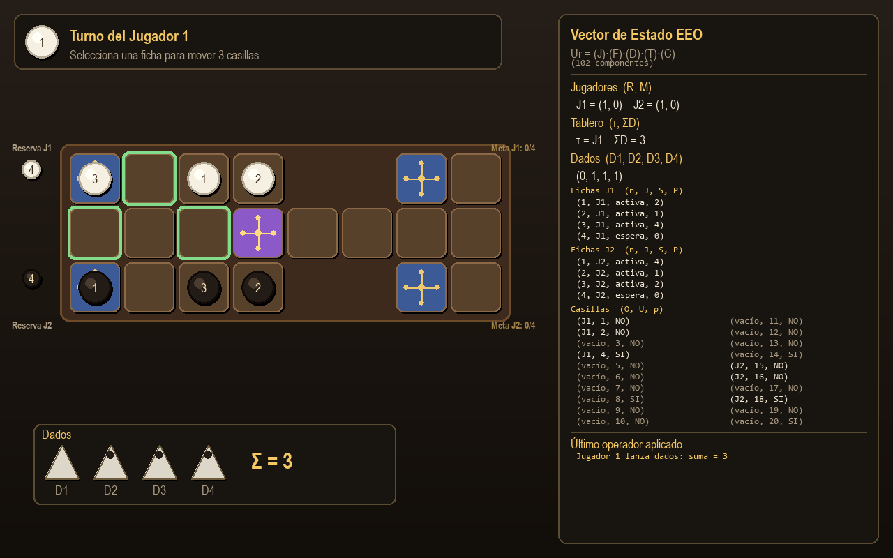
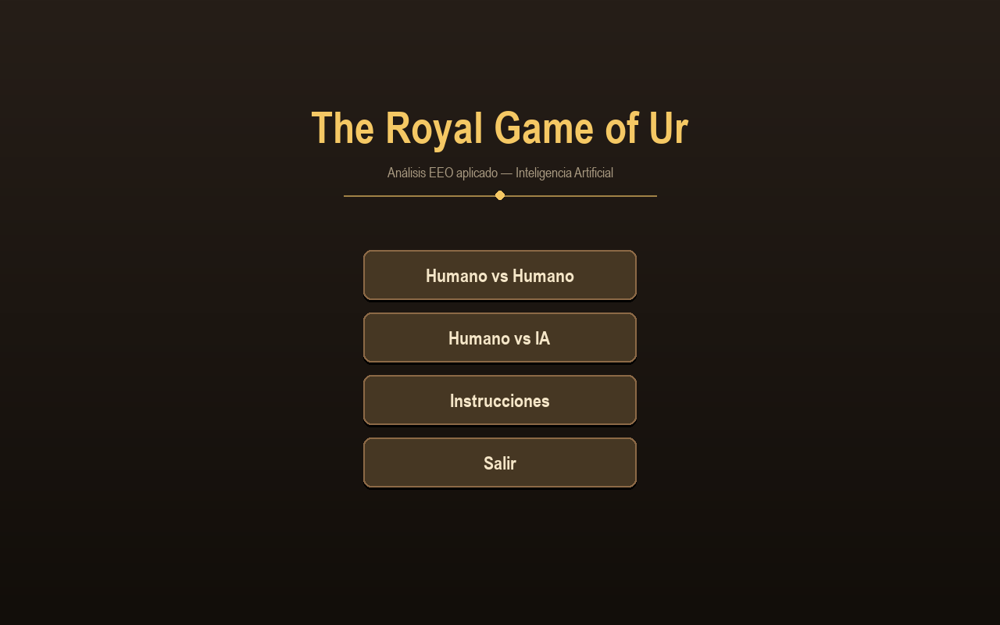
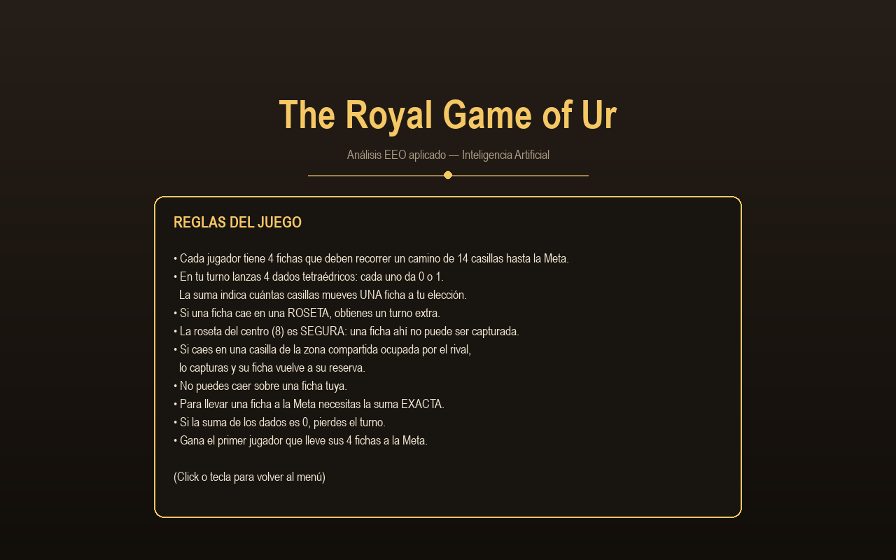

# The Royal Game of Ur — Implementación EEO

Implementación en **Python + Pygame** del *Royal Game of Ur*, basada directamente
en el análisis Entidad-Estado-Operador (EEO) desarrollado para la materia
de Inteligencia Artificial.

El juego original es de la antigua Mesopotamia (≈ 2600 a.C.). Se redescubrió
en las Tumbas Reales de Ur. Las reglas usadas aquí siguen la interpretación de
Irving Finkel a partir de una tablilla cuneiforme babilónica.



---

## Características

- **2 modos de juego**:
  - Humano vs Humano (mismo teclado/ratón).
  - Humano vs IA.
- **IA con Expectiminimax** profundidad 3 + heurística avanzada (capturas,
  rosetas, amenazas/oportunidades reales en zona compartida, control de la
  roseta segura, distancia a meta).
- **Panel EEO en vivo**: muestra el vector de estado de **102 componentes**
  actualizándose en tiempo real (jugadores, fichas, dados, tablero, casillas)
  además del último operador aplicado.
- **Reglas íntegras**:
  - 4 dados tetraédricos binarios → suma 0..4 con probabilidades binomiales.
  - Rosetas dan turno extra. La roseta 8 (centro) es además inmune a captura.
  - Captura en zona compartida (5–12, salvo la 8).
  - Salida del tablero requiere número exacto.
  - Suma 0 hace perder turno.
  - Bloqueo: no se puede caer sobre ficha propia.
- **UI minimalista** con paleta dorada/madera + lapislázuli, fichas con efecto
  3D, dados estilo tetraedro y resaltado verde de movimientos legales.

---

## Capturas

| Menú principal | Tablero en partida | Reglas |
| --- | --- | --- |
|  |  |  |

---

## Requisitos

- Python 3.10 +
- Pygame 2.5 +

## Instalación

```bash
pip install -r requirements.txt
```

## Cómo ejecutar

```bash
python main.py
```

## Controles

- **Lanzar dados**: botón inferior izquierdo (también auto-pasa el turno si la
  suma es 0 o no hay movimientos legales).
- **Mover ficha**: clic sobre la ficha que quieres mover (puede estar en la
  reserva o en el tablero). Las casillas destino válidas se resaltan en verde.
- **Pasar turno**: cuando los dados suman 0 o no hay jugada posible.

---

## Análisis EEO aplicado

Este software es la materialización del análisis EEO desarrollado en la fase
documental. Cada estructura del código corresponde 1:1 con la representación
formal.

### Tabla 1 — Entidades, atributos y estados

| Entidad | Símbolo | Atributos (variables) | Estados |
| ------- | ------- | --------------------- | ------- |
| **Jugador** | $J_j$ ($j \in \{1, 2\}$) | Reserva $R_j$, Meta $M_j$ | $\{0..4\}$, $\{0..4\}$ |
| **Ficha** | $F_i$ ($i \in \{1..8\}$) | Número $n_i$, Dueño $J_i$, Estado $S_i$, Posición $P_i$ | $\{1..4\}$, $\{J_1, J_2\}$, $\{\text{espera, activa, completada}\}$, $\{0..14\}$ |
| **Dado** | $D_k$ ($k \in \{1..4\}$) | Resultado $D_k$ | $\{0, 1\}$ |
| **Tablero** | $T$ | Turno $\tau$, Suma de dados $\Sigma D$ | $\{J_1, J_2\}$, $\{0..4\}$ |
| **Casilla** | $C_n$ ($n \in \{1..20\}$) | Ocupante $O_n$, Ubicación $U_n$, Roseta $\rho_n$ | $\{\text{vacío}, J_1, J_2\}$, $\{1..20\}$, $\{\text{sí, no}\}$ |

**Vector de estado completo:**
$$\vec{Ur} = (R_1, M_1, R_2, M_2, \; n_i J_i S_i P_i \times 8, \; D_1 D_2 D_3 D_4, \; \tau, \Sigma D, \; O_n U_n \rho_n \times 20)$$

Total: **102 componentes**.

### Tabla 2 — Operadores y reglas

| Operador | Condición | Efecto sobre el estado |
| -------- | --------- | ---------------------- |
| Lanzar dados | $\tau = J_j$ | $D_k \in \{0,1\}$ aleatorio, $\Sigma D = \sum D_k$ |
| Entrar ficha | $R_j > 0 \land \Sigma D > 0 \land O_{\text{destino}} \neq J_j$ | $S_i: \text{espera} \rightarrow \text{activa}$, $P_i = \Sigma D$, $O_{\text{destino}} = J_j$, $R_j \mathrel{-}= 1$ |
| Mover ficha | $S_i = \text{activa} \land P_i + \Sigma D \leq 14$ + casillas válidas | Libera origen, $P_i \mathrel{+}= \Sigma D$, ocupa destino |
| Completar ficha | $P_i + \Sigma D = 15$ (exacto) | $S_i: \text{activa} \rightarrow \text{completada}$, $M_j \mathrel{+}= 1$ |
| Capturar | Aterriza en compartida ocupada por rival ($\neq$ roseta 8) | Ficha rival: $S \rightarrow \text{espera}$, $R_{\text{rival}} \mathrel{+}= 1$ |
| Turno extra | $\rho_{\text{destino}} = \text{sí}$ | $\tau$ se mantiene |
| Cambiar turno | $\rho_{\text{destino}} = \text{no}$ tras movimiento | $\tau = J_{\text{opuesto}}$ |
| Perder turno | $\Sigma D = 0$ ó sin jugadas legales | $\tau = J_{\text{opuesto}}$ |

### Mapeo código ↔ EEO

| Componente del análisis | Implementación |
| ----------------------- | -------------- |
| Tabla 1 (entidades / atributos) | [`game/state.py`](game/state.py), [`game/constants.py`](game/constants.py) |
| Vector de estado (102 comp.) | Clase `GameState` + panel [`ui/eeo_panel.py`](ui/eeo_panel.py) |
| Tabla 2 (operadores) | [`game/operators.py`](game/operators.py) — un operador por función |
| Espacio de estados | Cada turno aplica un operador → genera transición visible en pantalla |
| Solución por agente IA | [`game/ai.py`](game/ai.py) — Expectiminimax sobre el espacio de estados |

---

## Arquitectura

```
Ur-Game/
├── main.py                   ← bucle principal de la app y orquestación
├── game/                     ← MODELO (independiente de la UI)
│   ├── constants.py          ← caminos, rosetas, identificadores (Tabla 1)
│   ├── state.py              ← Piece, GameState (vector EEO)
│   ├── operators.py          ← 8 operadores (Tabla 2) como funciones puras
│   └── ai.py                 ← Expectiminimax + heurística
├── ui/                       ← VISTA Pygame
│   ├── theme.py              ← paleta de colores y dimensiones
│   ├── widgets.py            ← Button + helpers de texto
│   ├── board_view.py         ← render del tablero, fichas, reservas/metas
│   ├── dice_view.py          ← render de los 4 dados con suma
│   ├── eeo_panel.py          ← panel del vector EEO en vivo
│   └── menus.py              ← menú principal, instrucciones, fin de juego
├── assets/                   ← capturas, imágenes
├── requirements.txt
└── README.md
```

### Sobre la IA

El oponente usa **expectiminimax** con poda alfa-beta (limitada a nodos de
decisión, ya que los nodos de azar — los lanzamientos de dados — no se pueden
podar). La función de evaluación pondera:

- Fichas en meta (alto peso positivo).
- Reserva del rival (positivo: le falta progresar).
- Avance lineal de fichas activas (no lineal: posiciones tardías valen más).
- Bono por roseta y bono extra por la roseta segura.
- Análisis dinámico de **amenazas reales**: cuántas sumas de dados permitirían
  al rival capturar una ficha propia en su próximo turno (ponderado por
  probabilidad binomial), y simétricamente cuántas oportunidades hay de
  capturar al rival.

A profundidad 3, la IA decide en ~200 ms por jugada y obtiene **~95 % de
victoria** contra un agente aleatorio.

---

## Video demostrativo

▶️ *Pendiente de subir.* (Cuando esté disponible, el link irá aquí.)

---

## Documento del análisis EEO

El análisis formal (Tabla 1, Tabla 2, Tabla de Espacio de Estados con vector de
102 componentes y partida ejemplo) se encuentra en el documento académico
asociado a esta entrega.

---

## Créditos

- Desarrollado por **Ángel Aldaz Carrillo** para la materia de Inteligencia
  Artificial — Décimo semestre, ITM.
- Reglas del juego según la interpretación de **Irving Finkel** (British Museum)
  basada en una tablilla babilónica del s. II a.C.

## Licencia

Uso académico. Contacta al autor para otros usos.
